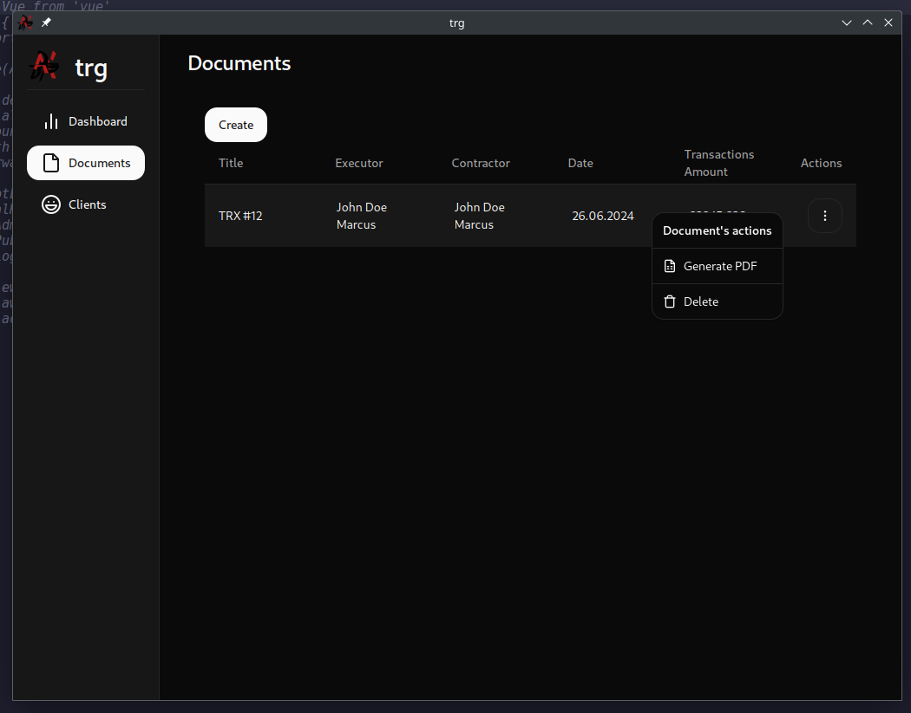
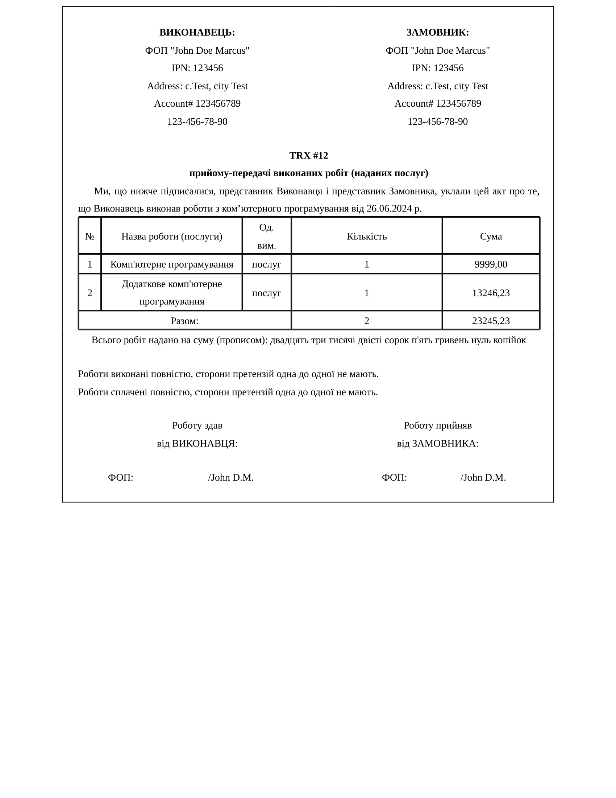

# README Tax Report Generation Desktop App


## About

This is a Tax Report Generation Desktop App designed to streamline the process of creating tax reports. The app supports desktop and mobile platforms, providing a versatile solution for various environments.

## Features

- **Cross-Platform Compatibility**: Supports desktop (Linux, Windows).
- **Frontend Framework**: Built using Angular for a robust and dynamic user interface.
- **Backend**: Powered by Golang and Wails for desktop applications.
- **PDF Generation**: Includes functionality to generate PDF reports.

## Requirements

- **Node.js**: v20.12.2
- **Go**: v1.22.2

## Tested On

- **Linux**: Manjaro Linux x86_64, Kernel 6.6.26-1-MANJARO
- **Windows**: Windows 11

## Installation and Usage

### Install Dependencies

Navigate to the `frontend` directory and install dependencies:

```bash
cd frontend
npm ci
npm run build
```

### Start Desktop App

Use the Wails CLI to run the desktop application:

```bash
wails dev
```

## Directory Structure

```plaintext
├── .github/
│   └── workflows/
├── api/
├── assets/
├── frontend/
├── os/
├── pdf/
├── storage/
├── .gitignore
├── README.md
├── app.go
├── go.mod
├── icon.go
├── logo.png
├── main.go
├── sqlc.yaml
└── wails.json
```

## Tools and Frameworks

- **Desktop**: Golang, Wails
- **Mobile**: Capacitor
- **Frontend**: Angular
- **UI**: SpartanNG

## Screenshots

### Desktop Interface



### PDF Report



## Contribution

Feel free to fork this repository and contribute by submitting pull requests. Any contributions, suggestions, or improvements are welcome.

## License

This project is licensed under the MIT License. See the [LICENSE](./LICENSE) file for details.

---

For more detailed documentation on how to use Wails, please refer to their official documentation:

- [Wails Documentation](https://wails.io/docs/)
